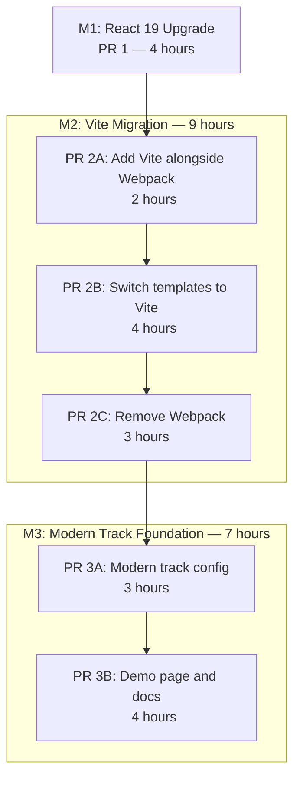

# Frontend Modernization: React 19 Upgrade, Vite Migration & Modern Track Foundation

## Enhancement Summary

**Deepened on:** 2026-02-19
**Agents used:** Architecture Strategist, Performance Oracle, Security Sentinel, Deployment Verification, Frontend Races Reviewer, Code Simplicity Reviewer, Pattern Recognition Specialist, Python/Django Reviewer, Best Practices Researcher

### Key Improvements from Research

1. **CRITICAL: `ManifestStaticFilesStorage` rejected** — Will double-hash Vite assets and break font URL rewriting. Use plain `StaticFilesStorage` instead; handle `_extra.css` cache-busting via query-string versioning.
2. **CRITICAL: `dev_mode` must NOT be tied to `DEBUG`** — Use a separate `VITE_DEV_MODE` environment variable to prevent catastrophic failures if `DEBUG=True` reaches production.
3. **CRITICAL: Define explicit `manualChunks` in Vite config** — Without this, Rollup's automatic chunk splitting shifts boundaries unpredictably between builds, causing cache invalidation churn for returning visitors.
4. **CRITICAL: Flux dispatch storm is wider than expected** — 12+ call sites use `setTimeout(...dispatch..., 100)` workarounds that may break under React 19's batching. Create a systematic `safeDispatch` wrapper, not ad-hoc fixes.
5. **CRITICAL: `createRoot` Map must store root objects, not render return values** — `root.render()` returns `undefined` in React 19 (unlike `ReactDOM.render()`), so deduplication logic will silently break.
6. **HIGH: Fix `ev.path` when fixing `findDOMNode`** — `ev.path` is Chrome-only; Firefox/Safari will crash. Replace with `!wrapperRef.current.contains(ev.target)`.
7. **HIGH: Catch-all URL pattern will swallow `/modern-demo`** — The regex at `files/urls.py:138` must be ordered after the modern-demo route.
8. **HIGH: Consider removing `postcss-custom-properties` entirely** — All target browsers support native CSS custom properties. The plugin only provides IE 11 fallbacks which Vite doesn't support anyway. Removing it avoids the 30-50% CSS size inflation from `preserve: true`.
9. **SECURITY: Environment variable leakage risk** — Vite exposes all `VITE_`-prefixed env vars to the client bundle. Add guardrails to prevent secrets from reaching frontend `.env` files.
10. **SIMPLICITY: M3 may be premature** — Code simplicity review suggests deferring Modern Track until first real feature needs it. Documented as an option but keeping current scope.

### New Considerations Discovered

- HMR will not work correctly for Flux store/dispatcher files (module-level singletons). Add `import.meta.hot.decline()` to prevent confusing partial updates.
- `CommentForm` in `Comments.js` has a `useEffect` without dependency array — will accumulate event listeners under React 19's batching.
- `EmbedPage.js` dispatches during render (line 39) — needs `useEffect` wrapper for React 19.
- `NavigationContentApp.js` leaks event listeners due to `changePageElements` being recreated each render — use `useRef`.
- `_currentValue` context access pattern (used throughout codebase) bypasses React subscriptions — modern-track components must use `useContext()`.
- Per-page transfer size budgets are more meaningful than aggregate bundle size metrics.
- HTTP/2 must be verified on production NGINX — Vite's code splitting produces more requests than the current 2-per-page approach.

---

## Overview

Modernize the CinemataCMS frontend build system and development patterns across 3 milestones (6 PRs, ~20 hours). This replaces the slow, complex Webpack 5 build (~760 LOC config, 15-30s dev server start) with Vite (~80 LOC, <500ms start), upgrades React 17 to 19, and establishes a Modern Track for new features using TanStack Query, Zustand, and Tailwind CSS. No existing features are rewritten — only build tooling and new-feature conventions change.

Source documents:
- [Action Plan](../technical/frontend-modernization/action-plan.md)
- [Whitepaper](../technical/frontend-modernization/frontend-modernization-whitepaper.md)
- [Research](../technical/frontend-modernization/frontend-modernization-research.md)
- [Technical Breakdown](../technical/frontend-modernization/technical-breakdown.md)

## Problem Statement

| Problem | Impact |
|---------|--------|
| Dev server starts in 15-30s, HMR takes 2-5s | Contributors give up before writing code |
| ~760 LOC Webpack config across 15+ files | Only 2-3 people understand the build; bus factor = 2 |
| Flux archived by Facebook (March 2023) | No new features can be built on a dead library |
| React 17.0.2 is 2 major versions behind | Experienced developers see outdated stack and move on |
| Zero frontend tests | Changes are verified by manual "click around and hope" |

## Proposed Solution

**Dual-track approach:**

- **Legacy track** — All existing components, Flux stores, and SCSS stay as-is. Bug fixes follow current patterns.
- **Modern track** — New features use React 19 hooks, TanStack Query (server state), Zustand (client state), and Tailwind CSS (styling via theme bridging to existing CSS custom properties).



---

## Phase Plans

Each phase has its own detailed plan file:

| Phase | Plan | Effort | Status |
|-------|------|--------|--------|
| **M1: React 19 Upgrade** | [m1-react19-upgrade-plan.md](./2026-02-19-feat-frontend-modernization-m1-react19-upgrade-plan.md) | ~4 hours | Complete |
| **M2: Vite Migration** (3 PRs) | [m2-vite-migration-plan.md](./2026-02-19-feat-frontend-modernization-m2-vite-migration-plan.md) | ~9 hours | Complete |
| **M3: Modern Track Foundation** (2 PRs) | [m3-modern-track-plan.md](./2026-02-19-feat-frontend-modernization-m3-modern-track-plan.md) | ~7 hours | Complete |

### Dependency Chain

```
M1 (React 19) → PR 2A (Vite alongside) → PR 2B (Templates) → PR 2C (Remove Webpack) → PR 3A (Modern config) → PR 3B (Demo page)
```

Each milestone has a go/no-go gate before proceeding to the next.

---

## Technical Approach

### Architecture

The core architecture change is replacing the Webpack build pipeline with Vite while preserving the Django-React integration pattern:

```
Django template (HTML shell + mount point)
  → Vite-bundled JS entry (3-line file in src/entries/)
    → renderPage() from _helpers.js
      → createRoot() on mount element
        → React component tree
```

Django-Vite integration:
- **Dev mode**: Django on :8000, Vite dev server on :5173. `` in `<head>` injects HMR WebSocket client. `` points script tags at :5173.
- **Production**: `npm run build` outputs hashed assets + `.vite/manifest.json`. `` reads manifest to resolve hashed filenames. No runtime dependency on Vite.

Key files that change:
- `frontend/src/static/js/classes_instances/components-renderer.js` — `ReactDOM.render()` → `createRoot()` with Map
- `frontend/src/static/js/components/-NEW-/PopupContent.js` — Remove `findDOMNode` **and fix `ev.path`** (Chrome-only)
- `frontend/src/static/js/components/-NEW-/NavigationContentApp.js` — Remove `findDOMNode`, fix event listener leak
- `frontend/src/static/js/components/MediaViewer/AudioViewer/index.js` — Convert string refs to `createRef()`, fix timer cleanup
- `frontend/src/static/js/pages/ProfilePage/includes/ProfilePagesHeader.js` — Convert string refs
- `frontend/src/static/js/pages/ProfilePage/About.js` — Convert string refs
- 31 Django templates — `` → ``
- `cms/settings.py` — Add `django_vite`, configure `DJANGO_VITE` settings
- `files/templatetags/webpack_manifest.py` — Delete (replaced by django-vite)
- `cms/storage.py` — Delete (Vite handles hashing)
- `frontend/config/postcss.config.js` — **Remove `postcss-custom-properties` entirely** (all target browsers support native CSS custom properties; see Research Insights below)

> **Architectural note (from research):** `renderPage()` creates 3 independent React roots per page (header, sidebar, content). Context providers do NOT span roots. Shared state across roots must flow through module-level singletons (Flux stores today, Zustand tomorrow). This is a known boundary, not a bug.

---

## Alternative Approaches Considered

| Approach | Why rejected |
|----------|-------------|
| **Big bang** — Rewrite all existing code + Vite + TypeScript + Zustand at once | 6 new technologies simultaneously, no rollback path, too risky |
| **Keep Webpack, only upgrade React** | Doesn't fix build complexity (bus factor = 2), dev server stays slow |
| **Custom manifest transform** instead of django-vite | Must maintain transform code ourselves; no HMR support |
| **Feature flag** for Webpack↔Vite toggle | Adds complexity to templates; action plan's atomic PR + revert is simpler |
| **Replace SCSS with Tailwind for existing code** | Rewrites existing features (out of scope), high risk of visual regressions |
| **`ManifestStaticFilesStorage`** for cache-busting | Double-hashes Vite assets, breaks font URL rewriting (see `cms/storage.py` docstring) |
| **`postcss-custom-properties: preserve: true`** | Inflates CSS 30-50%; removing the plugin entirely is simpler and smaller |

## Acceptance Criteria

### Functional Requirements

- [x] React 19.x installed, `npm ls react` shows no peer dependency errors
- [x] All 30+ page types load without console errors in both dev and production
- [x] `findDOMNode` fully removed from codebase (2 files fixed)
- [x] `ev.path` replaced with `contains()` in PopupContent.js
- [x] String refs fully removed from codebase (3 files converted to `createRef()`)
- [x] `safeDispatch` wrapper created and tested for Flux dispatch chain conflicts
- [x] Vite production build succeeds with 27+ entries in `.vite/manifest.json`
- [x] `` renders HMR client in dev, nothing in production
- [x] `_extra.css` loads correctly via `` with query-string cache-busting
- [x] `/modern-demo` page renders, fetches API data, and supports theme toggle
- [x] `/modern-demo` URL route placed above catch-all pattern in `files/urls.py`
- [x] Existing `/demo` page unchanged
- [x] Dark/light theme toggle works on both legacy and modern-track pages

### Non-Functional Requirements

- [x] Dev server cold start < 500ms (baseline: 15-30s)
- [x] First page load in dev < 3s for heaviest page (media.js)
- [x] HMR latency < 500ms (baseline: 2-5s)
- [x] Per-page gzipped transfer size budgets met (no page > 300KB gzipped JS)
- [x] `npm audit` does not introduce new vulnerabilities vs baseline
- [x] Zero Webpack references remaining in codebase (grep verification)
- [x] CSS custom properties preserved at runtime (PostCSS plugin removed entirely)
- [x] No source maps in production build
- [x] `VITE_DEV_MODE` env var controls dev mode (not `DEBUG`)

### Quality Gates

- [x] Smoke test checklist passed for each milestone (14+ page types)
- [x] `grep -r "webpack_manifest\|hashed_static" templates/` returns zero results
- [x] `npm ls` clean (no orphaned or missing dependencies)
- [x] `manage.py check` passes
- [x] `postcss-custom-properties` removed from dependencies
- [x] Post-migration metrics recorded and compared to baseline
- [x] ADR written (`docs/technical/adr-001-webpack-to-vite.md`)
- [x] `CONTRIBUTING.md` updated with dual-track docs
- [x] PR template created with modern-track checklist
- [x] ESLint rules enforce track boundary (no-restricted-imports)
- [x] `frontend/.env` added to `.gitignore`

## Success Metrics

| Metric | Before (M1 baseline) | After (M3 complete) |
|--------|----------------------|---------------------|
| Dev server cold start | 15-30s | < 500ms |
| First page load (dev) | N/A | < 3s (media page) |
| HMR latency | 2-5s | < 500ms |
| Build config LOC | ~760 | ~80 |
| Webpack dependencies | ~20 packages | 0 |
| Production build | Succeeds | Succeeds |
| Console errors | 0 | 0 |
| Lightest page JS transfer | ~320KB gzipped (commons + page) | ~60KB gzipped (vendor + minimal) |
| Heaviest page JS transfer | ~340KB gzipped (commons + media) | ~150KB gzipped (vendor + media chunks) |
| CSS output | Baseline | Reduced (PostCSS plugin removed) |
| HTTP requests per page | 2 JS + 2-3 CSS | 4-8 JS + 1-3 CSS (HTTP/2 required) |
| Contributor onboarding | Read ~400 LOC config | Read ~80 LOC config + CONTRIBUTING.md |

## Dependencies & Prerequisites

| Dependency | Status | Notes |
|------------|--------|-------|
| `django-vite` (PyPI) | Stable (v3.x, 826+ stars) | Thin wrapper; replaceable with ~30 lines if needed |
| `vite` + `@vitejs/plugin-react` | Stable | Industry standard |
| `tailwindcss` + `@tailwindcss/vite` | Stable (v4.x) | Only for new features; verify v3 vs v4 config format |
| `@tanstack/react-query` | Stable | ~12KB, excellent DevTools |
| `zustand` | Stable | ~3KB, minimal API |
| Docker services (PostgreSQL, Redis) | Running | Required for dev with real Django data |
| Existing Flux stores | Archived but functional | No changes to existing stores; override pinned to 4.0.4 |
| HTTP/2 on NGINX | Verify | Required for code splitting to not regress request count |

## Risk Analysis & Mitigation

### Critical Risks

| Risk | Likelihood | Impact | Mitigation |
|------|-----------|--------|------------|
| `findDOMNode` crashes on React 19 | **Certain** | High — popups and navigation break site-wide | Fix in M1 before upgrade (2 files, simple ref changes) |
| String ref crashes on React 19 | **Certain** | High — AudioViewer and Profile pages crash | Fix in M1 before upgrade (3 files, `createRef()` conversion) |
| `ManifestStaticFilesStorage` double-hashes Vite assets | **Certain** if used | High — broken font URLs, double-hashed filenames | Use `StaticFilesStorage` instead + query-string versioning |
| `dev_mode` tied to `DEBUG` reaches production | Medium | **Critical** — site fully broken or XSS via port 5173 | Use dedicated `VITE_DEV_MODE` env var |
| Template tag typo silently breaks page | Medium | Medium — single page broken until visited | Post-migration grep + manual smoke test of all pages |

### High Risks

| Risk | Likelihood | Impact | Mitigation |
|------|-----------|--------|------------|
| Flux dispatch conflicts with React 19 batching | **High** (12+ sites) | Medium — console errors, cascading re-dispatches | `safeDispatch` wrapper (macrotask queue); systematic audit |
| `ev.path` Chrome-only API breaks Firefox/Safari | **Certain** if unfixed | Medium — popups fail to close in non-Chrome | Replace with `!ref.contains(ev.target)` in M1 |
| Catch-all URL swallows `/modern-demo` | **Certain** if unordered | Medium — 404 on demo page | Place route above catch-all in `files/urls.py` |
| `_extra.css` served without cache-busting | Medium | Medium — stale styles after deployment | Query-string versioning: `?v={{ EXTRA_CSS_VERSION }}` |
| `process.env` usage breaks under Vite | Medium | Medium — env vars undefined at runtime | Audit before M2C; current grep shows zero usage in `src/` |
| SCSS compilation differences between Webpack and Vite | Low | High — widespread styling breaks | Verify all SCSS compiles under Vite's built-in Sass support |
| Environment variable leakage via `VITE_` prefix | Medium | **Critical** if secrets exposed | Guardrails: `.gitignore`, CI check, documentation |

### Medium Risks

| Risk | Likelihood | Impact | Mitigation |
|------|-----------|--------|------------|
| `browserslist` target change drops old browsers | Medium | Low — very old browsers unsupported | Document new browser support policy |
| CSP headers block Vite dev server | Medium | Low — dev-only issue | No CSP exists currently; add as follow-up |
| Code splitting changes affect cache efficiency | Medium | Medium — cache invalidation churn | `manualChunks` configuration in Vite config (day-one) |
| Local `file:` package refs (`media-player`) incompatible with Vite | Medium | Medium — video player breaks | Verify in PR 2A before switching templates |
| HMR confuses developers when editing singletons | Medium | Low — wasted debugging time | `import.meta.hot.decline()` on store/dispatcher files |
| `CORS_ORIGIN_ALLOW_ALL = True` in production | **Current** | High — CSRF via cross-origin requests | Fix separately (not in migration scope, but flagged) |

## Rollback Strategy

Every milestone has a clean undo path:

| Milestone | Rollback |
|-----------|----------|
| **M1** | `npm install react@17 react-dom@17`, revert `components-renderer.js`, revert `findDOMNode` fixes, revert `createRef()` conversions |
| **PR 2A** | Delete Vite config + entry files, remove `django-vite`. Webpack is still active. |
| **PR 2B** | Revert the template PR. Webpack files still present. |
| **PR 2C** | Restore from `legacy/webpack-backup` branch (create from commit **just before PR 2C**, not before M1, so React 19 + template changes are preserved). Also create `backup/pre-webpack-removal` from just before PR 2C. |
| **PR 3A** | Remove config files + uninstall 3 packages. Vite build still works. |
| **PR 3B** | Delete demo page files. Nothing else affected. |

### Deployment Sequencing

| Deployment | Minimum Wait After Previous | Deploy Window | Staff |
|------------|----------------------------|---------------|-------|
| M1 (React 19) | N/A | Any low-traffic period | 1 engineer |
| PR 2A (Vite alongside) | 24h after M1 | Any time (low risk) | 1 engineer |
| PR 2B (Template switch) | Immediately after 2A | **Lowest traffic window** | 1 engineer + 1 tester |
| PR 2C (Webpack removal) | **24h minimum** after PR 2B | Low-traffic period | 1 engineer |
| NGINX cache changes | 24h after PR 2C | Any time | 1 engineer |
| M3 (Modern track) | 48h after PR 2C | Any time (additive only) | 1 engineer |

## Security Recommendations (from security review)

These items are outside the migration scope but were identified during review:

| Item | Severity | Action |
|------|----------|--------|
| `CORS_ORIGIN_ALLOW_ALL = True` in production | **HIGH** | Replace with explicit allowlist in production settings |
| No Content Security Policy | **HIGH** | Add CSP (report-only initially) as a follow-up issue |
| Hardcoded `SECRET_KEY` in `dev_settings.py` (tracked in git) | **HIGH** | Rotate immediately |
| `X_FRAME_OPTIONS = "ALLOWALL"` | **MEDIUM** | Restrict to embed-specific views only |
| 12+ `dangerouslySetInnerHTML` usages (pre-existing) | **MEDIUM** | Track as separate security issue; add ESLint warn for new `features/` code |
| `frontend/.env` tracked in git | **LOW** | Add to `.gitignore` |

## Future Considerations

- **TypeScript**: Separate initiative after build is stable. Don't combine with migration (two variables when debugging).
- **Automated testing**: Add Vitest for new modern-track features. Existing code relies on manual QA.
- **React Compiler**: React 19 supports automatic memoization — evaluate after migration is stable.
- **Server Components**: Optional future optimization for content-heavy pages. Not in scope.
- **Flux removal timeline**: Set a deadline for migrating remaining Flux stores to Zustand. Flux is archived and receives no security patches.
- **`dangerouslySetInnerHTML` audit**: Review all 12+ usages, especially `Comments.js` line 266 which does `text.replace(/\n/g, '<br />')` without sanitization.
- **CSP implementation**: Start with report-only mode covering `script-src`, `style-src`, `connect-src`.

## Documentation Plan

| Document | Action | When |
|----------|--------|------|
| `CONTRIBUTING.md` | Add dual-track section, dev workflow, PR checklist, naming conventions | PR 3B |
| `CLAUDE.md` | Update dev commands, frontend architecture section | PR 2C |
| `docs/technical/adr-001-webpack-to-vite.md` | Create ADR | PR 2C |
| `docs/setup/Developer-Onboarding.md` | Update build commands | PR 2C |
| `docs/setup/mac-setup-docker.md` | Update build commands | PR 2C |
| `.github/PULL_REQUEST_TEMPLATE.md` | Create with modern-track checklist | PR 3B |
| `docs/technical/frontend-modernization/baseline-metrics.md` | Create with pre-migration measurements | M1 start |

## References

### Internal References

- Rendering chokepoint: `frontend/src/static/js/classes_instances/components-renderer.js:1-31`
- Helper functions: `frontend/src/static/js/_helpers.js:1-33`
- Webpack config factory: `frontend/scripts/utils/webpack-config/webpack.configuration.js:1-372`
- Page configs (virtual modules): `frontend/config/cinemata/cinemata.mediacms.pages.config.js:1-247`
- Template tag (to delete): `files/templatetags/webpack_manifest.py:1-147`
- Custom storage (to delete): `cms/storage.py:1-38`
- PostCSS config: `frontend/config/postcss.config.js:12` (`preserve: false`)
- Light theme variables: `frontend/src/static/css/config/_light_theme.scss:1-380`
- Dark theme variables: `frontend/src/static/css/config/_dark_theme.scss`
- `findDOMNode` usages: `components/-NEW-/PopupContent.js:2,22`, `components/-NEW-/NavigationContentApp.js:3,17`
- `ev.path` (Chrome-only): `components/-NEW-/PopupContent.js:24`
- String ref usages: `MediaViewer/AudioViewer/index.js:88,120,129,167,205,243,244,366`, `ProfilePagesHeader.js:121,156,321`, `ProfilePage/About.js:51,57`
- Django settings: `cms/settings.py:204-230` (static files config)
- Catch-all URL: `files/urls.py:138`
- LayoutContext (migration direction proof): `frontend/src/static/js/contexts/LayoutContext.js:1-161`
- EmbedPage dispatch issue: `frontend/src/static/js/pages/EmbedPage.js:39`
- CommentForm listener leak: `frontend/src/static/js/components/-NEW-/Comments.js:111-119`
- Flux dispatcher: `frontend/src/static/js/classes_instances/dispatcher.js`
- `dangerouslySetInnerHTML` in Comments: `frontend/src/static/js/components/-NEW-/Comments.js:266,288`

### External References

- React 19 Release: https://react.dev/blog/2024/12/05/react-19
- React 19 Upgrade Guide: https://react.dev/blog/2024/04/25/react-19-upgrade-guide
- React 19 Codemod: `npx codemod@latest react/19/migration-recipe`
- Vite Documentation: https://vitejs.dev/
- Vite Backend Integration: https://vite.dev/guide/backend-integration
- django-vite: https://github.com/MrBin99/django-vite
- TanStack Query: https://tanstack.com/query/latest
- Zustand: https://zustand-demo.pmnd.rs/
- Flux (Archived): https://github.com/facebookarchive/flux

### Related Work

- Existing modernization docs: `docs/technical/frontend-modernization/`
- Frontend workflow: `docs/technical/FRONTEND_WORKFLOW.md`
- Static files versioning: `docs/technical/STATIC_FILES_VERSIONING.md`
