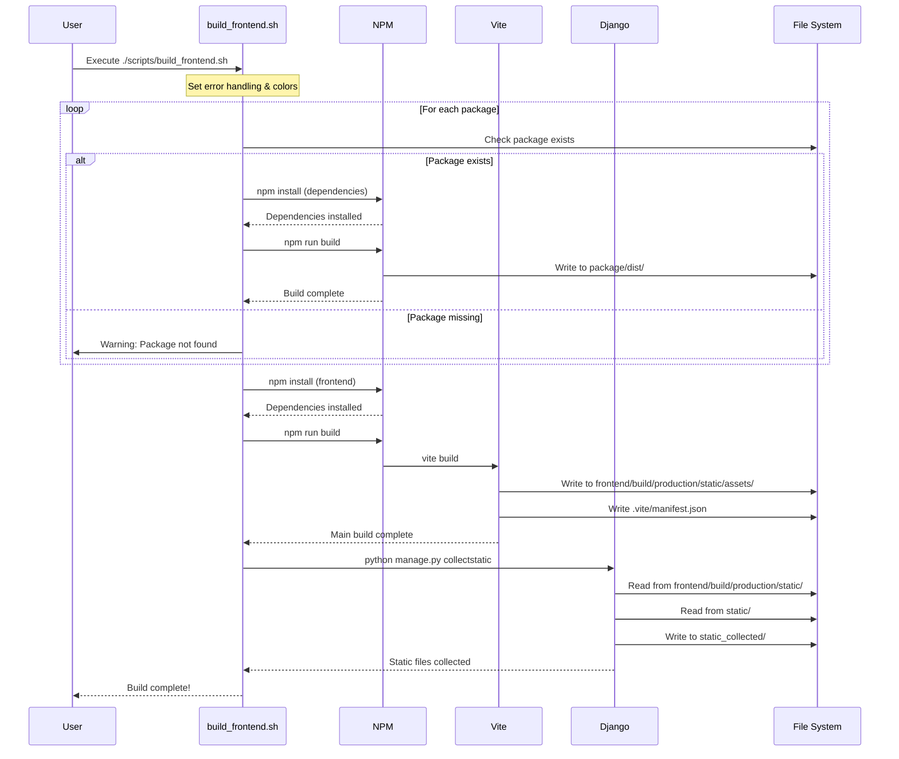

# Frontend Development Workflow

This document describes the frontend build and deployment process for CinemataCMS.

## Overview

The frontend consists of:

- Main frontend application (`/frontend`) — built with **Vite**
- VJS Plugin packages (`/frontend/packages/`) — built independently with their own build tools
  - `vjs-plugin`
  - `vjs-plugin-font-icons`
  - `media-player`

## Prerequisites

### Node.js Installation

CinemataCMS requires Node.js v20 LTS for building frontend assets.

- **Verification**: Run `node -v` and `npm -v` to confirm installation
- See [Developer Onboarding](../setup/Developer-Onboarding.md) for installation instructions

## Quick Start for Developers

### 1. After Making Frontend Changes

```bash
# Option 1: Use the build script (Recommended)
./scripts/build_frontend.sh

# Option 2: Use Makefile
make frontend-build

# Option 3: Quick build (main app only, skips packages)
make quick-build
```

### 2. Development Workflow (with HMR)

```bash
# Terminal 1: Start Django with Vite dev mode enabled
VITE_DEV_MODE=True make dev-server

# Terminal 2: Start Vite dev server
make frontend-dev

# Browse at http://127.0.0.1:8000 — HMR is automatic
```

### 3. Clean Build

```bash
# Remove all build artifacts
make frontend-clean

# Full rebuild
make frontend-clean && make frontend-build
```

## Understanding the Build System

### Vite Configuration

**File**: `frontend/vite.config.js`

Vite is configured with:
- **27 entry points** — one per Django template/page type
- **JSX-in-.js plugin** — handles legacy `.js` files containing JSX
- **SCSS support** — built-in via the `sass` package
- **Code splitting** — `manualChunks` for vendor libraries (React, axios, flux, etc.)
- **Content hashing** — production filenames include content hashes (e.g., `index-EGWbBqaA.css`)

### Entry Points

Each page type has a corresponding entry file in `frontend/src/entries/`:

```
src/entries/
├── base.js           # Base layout (header + sidebar)
├── index.js          # Home page
├── media.js          # Media viewing page
├── search.js         # Search page
├── embed.js          # Embedded player
├── playlist.js       # Playlist page
├── add-media.js      # Upload page
├── manage-media.js   # Media management
├── profile-home.js   # User profile
└── ...               # 27 entries total
```

Each entry imports the page component and calls `renderPage()`:

```javascript
import { renderPage } from '../static/js/_helpers';
import HomePage from '../static/js/pages/HomePage';

renderPage('page-home', HomePage);
```

### Django Integration (django-vite)

Django templates use `django-vite` template tags to load Vite assets:

```django


{# In root.html <head>: #}



{# In page templates: #}

```

`` automatically:
- Injects the JS `<script type="module">` tag
- Injects all CSS `<link>` tags from the chunk dependency graph
- Adds `<link rel="modulepreload">` for JS dependencies

### Build Process

**Build Order:**

1. Build frontend packages (in order):
   - `vjs-plugin-font-icons`
   - `vjs-plugin`
   - `media-player`
2. Build main frontend application (`npm run build` → `vite build`)
3. Django `collectstatic` collects everything to `static_collected/`

### Build Process Sequence Diagram



### Directory Structure

```
cinematacms/
├── frontend/                         # Frontend source
│   ├── src/
│   │   ├── entries/                 # Vite entry points (one per page)
│   │   └── static/
│   │       ├── js/                  # React components, pages, stores
│   │       └── css/                 # SCSS styles and themes
│   ├── build/                       # Build output
│   │   └── production/
│   │       └── static/
│   │           ├── assets/          # Vite-built JS/CSS (content-hashed)
│   │           └── .vite/
│   │               └── manifest.json # Vite manifest (maps entries to hashed files)
│   ├── packages/                    # Frontend packages
│   │   ├── vjs-plugin/
│   │   ├── vjs-plugin-font-icons/
│   │   └── media-player/
│   ├── vite.config.js               # Vite configuration
│   └── postcss.config.js            # PostCSS (autoprefixer)
├── static/                          # Django & third-party static files (DO NOT DELETE)
│   ├── admin/                      # Django admin static files
│   ├── lib/                        # Libraries (video.js, fonts, etc.)
│   ├── css/_extra.css              # Site-specific CSS overrides
│   └── ...
├── static_collected/                # Final collected static files (git-ignored)
│   ├── assets/                     # Vite assets (from frontend build)
│   ├── admin/                      # Django admin files
│   ├── lib/                        # Libraries
│   └── css/_extra.css              # Site-specific CSS
└── scripts/
    └── build_frontend.sh            # Build automation script
```

**Important**: The `static/` folder contains Django admin files, third-party libraries, and `_extra.css`. Do NOT delete it.

## Makefile Commands

| Command | Description |
|---------|-------------|
| `make frontend-build` | Build all frontend packages and collect static |
| `make frontend-dev` | Start Vite development server (HMR) |
| `make frontend-clean` | Clean all build directories |
| `make quick-build` | Build main app only (skips packages) |

## Configuration

### Django Settings

The following settings in `cms/settings.py` control static file and Vite handling:

```python
# Static files URL prefix
STATIC_URL = "/static/"

# Where collectstatic outputs files
STATIC_ROOT = os.path.join(BASE_DIR, "static_collected")

# Where Django looks for static files
STATICFILES_DIRS = [
    os.path.join(BASE_DIR, "frontend", "build", "production", "static"),
    os.path.join(BASE_DIR, "static"),
]

# Plain storage — Vite already handles content hashing
STORAGES = {
    "staticfiles": {
        "BACKEND": "django.contrib.staticfiles.storage.StaticFilesStorage",
    },
}

# Django-Vite integration
DJANGO_VITE = {
    "default": {
        "dev_mode": os.getenv("VITE_DEV_MODE", "False") == "True",
        "manifest_path": os.path.join(BASE_DIR, "frontend", "build", "production", "static", ".vite", "manifest.json"),
    },
}
```

### Dev Mode

Set `VITE_DEV_MODE=True` in your environment to enable HMR:
- Django serves pages on port 8000
- `` injects a script that connects to Vite on port 5173
- Asset changes reflect instantly without page reload

### NGINX Configuration (Production)

```nginx
location /static/ {
    alias /home/cinemata/cinematacms/static_collected/;

    # Vite hashed assets — cache aggressively
    location ~* /static/assets/ {
        expires 1y;
        add_header Cache-Control "public, immutable";
    }

    # Block Vite manifest from public access
    location /static/.vite/ {
        deny all;
        return 404;
    }

    # Non-hashed assets — moderate cache
    expires 7d;
    add_header Cache-Control "public";
}
```

## Troubleshooting

### Problem: Changes not appearing

1. Clear browser cache
2. Run `make frontend-clean && make frontend-build`
3. Run `uv run manage.py collectstatic --noinput`

### Problem: Build fails

1. Check Node.js installation: `node --version` (should be v20.x)
2. Clear npm cache: `npm cache clean --force`
3. Remove node_modules and reinstall:
   ```bash
   cd frontend && rm -rf node_modules && npm install
   ```

### Problem: HMR not working

1. Verify Vite dev server is running (`make frontend-dev`)
2. Verify `VITE_DEV_MODE=True` is set for the Django process
3. Check browser console for WebSocket connection errors to port 5173
4. Ensure both Django (8000) and Vite (5173) servers are running

### Problem: collectstatic reports 0 files

1. Check `frontend/build/production/static/` contains files
2. Verify `STATICFILES_DIRS` configuration
3. Ensure `static/` folder exists

### Problem: 404 errors for static files

1. Run `uv run manage.py collectstatic --noinput`
2. Check `STATIC_URL` and `STATIC_ROOT` configuration
3. Ensure web server is configured to serve from `STATIC_ROOT`

## Development Tips

1. **Use Vite dev server for rapid development** — CSS/JS changes reflect instantly via HMR
2. **Use `make quick-build`** when only main app code changed (skips package builds)
3. **Sub-packages are independent** — they use their own build tools and only need rebuilding when their code changes
