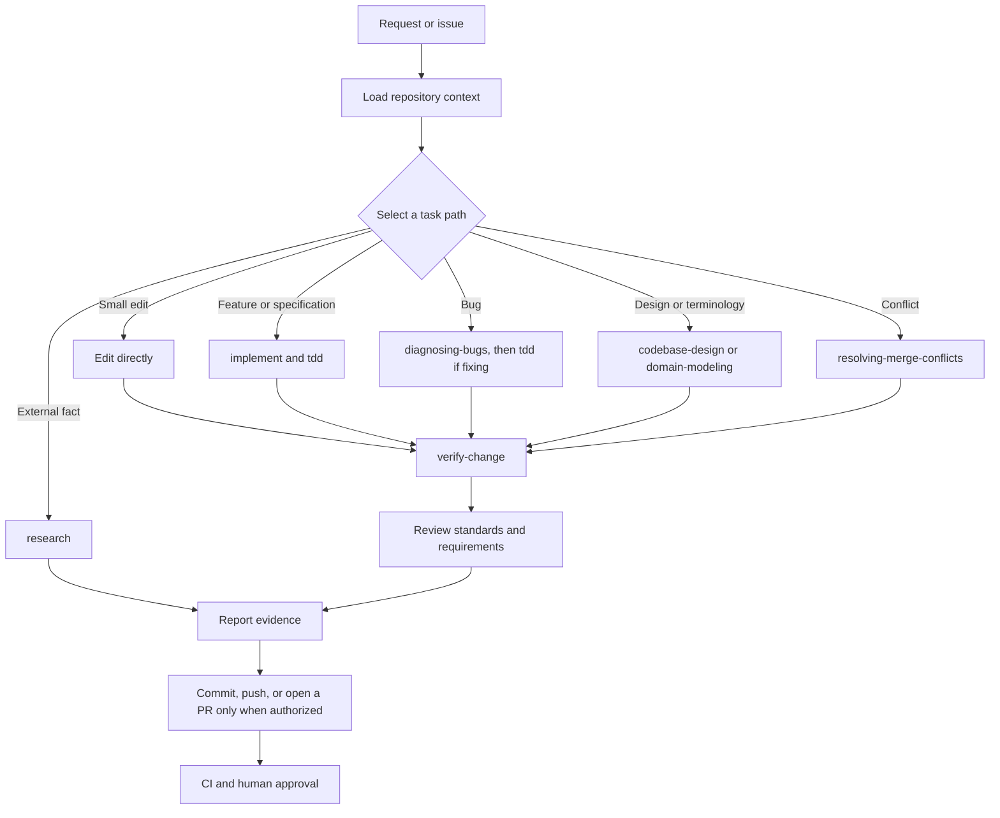

# Shared agentic workflow

This repository gives coding agents one task lifecycle, one set of project
rules, and one verification baseline. Contributors can choose their agent and
local tools. The required evidence stays the same.

## Run repository work

Every task follows this lifecycle:



### Load the task context

Start by inspecting the current branch, worktree, and relevant diff. Preserve
changes that already belong to the contributor. Read the code and tests around
the requested behavior before choosing an edit location.

`AGENTS.md` routes each task to the coding standards, contributor guide,
frontend workflow, onboarding guide, engineering policy, and this document.
Load only the sources that apply to the task.

### Select one primary task path

Use the path that matches the requested outcome:

| Task | Primary path | Example request | Completion point |
|---|---|---|---|
| Small documentation or configuration edit | Work directly | `Fix the broken link in docs/index.md.` | The focused diff is verified |
| Scoped issue, specification, or acceptance criteria | [`implement`](../../.agents/skills/implement/SKILL.md) | `Use implement for issue #123.` | Every requirement has evidence |
| New behavior or requested regression test | [`tdd`](../../.agents/skills/tdd/SKILL.md) | `Use tdd to add a regression test for duplicate uploads.` | Each behavior completes a red-green-refactor cycle |
| Reported defect, flaky test, or regression | [`diagnosing-bugs`](../../.agents/skills/diagnosing-bugs/SKILL.md) | `Use diagnosing-bugs to find why uploads stall.` | The cause is established; fix only when requested |
| Module interface or refactor design | [`codebase-design`](../../.agents/skills/codebase-design/SKILL.md) | `Use codebase-design to redesign the media service interface.` | The interface, seam, callers, and tests are defined |
| Domain term, context boundary, or durable decision | [`domain-modeling`](../../.agents/skills/domain-modeling/SKILL.md) | `Use domain-modeling to define the moderation context.` | Language and recorded decisions agree with the intended domain |
| Current external technical fact | [`research`](../../.agents/skills/research/SKILL.md) | `Use research to verify the supported Django API.` | Each recommendation is traceable to a primary source |
| In-progress merge or rebase conflict | [`resolving-merge-conflicts`](../../.agents/skills/resolving-merge-conflicts/SKILL.md) | `Use resolving-merge-conflicts to finish this rebase.` | Git has no unresolved path and affected behavior is verified |
| Branch, pull request, commit range, or worktree review | [`code-review`](../../.agents/skills/code-review/SKILL.md) | `Use code-review to review this worktree.` | Actionable findings and residual risks are reported without edits |
| `AGENTS.md`, `CLAUDE.md`, or shared skill change | [`writing-for-agents`](../../.agents/skills/writing-for-agents/SKILL.md) | `Use writing-for-agents to update AGENTS.md.` | Pointers, ownership, and skill triggers are unambiguous |
| Any completed change | [`verify-change`](../../.agents/skills/verify-change/SKILL.md) | `Use verify-change to check this diff.` | Every affected area has a passed, failed, blocked, or unrun result |

The examples use ordinary requests instead of agent-specific slash commands.
They work across the supported agents.

A small direct edit does not need `implement`. A feature can use `implement` as
the primary path and call `tdd` for each behavior. A bug fix starts with
`diagnosing-bugs`, preserves the reproduction as a regression test, and then
uses `tdd` for the fix.

The contributor can invoke a skill by name. Supported agents may also select a
skill when the request matches its frontmatter description. When a contributor
names a skill, the agent must follow it.

### Stop at human decision points

Proceed while the work stays inside the accepted scope and any assumption is
local and reversible. Ask the contributor when a missing choice would change
public behavior, the data model, a security boundary, delivery scope, or an
external system.

`AGENTS.md` defines the authorization boundaries for commits, pushes, pull
requests, merges, destructive actions, and user-owned changes. A request to
implement code does not grant permission to merge it.

### Work in verified slices

Trace the affected public boundary and its existing tests. Implement the
smallest observable behavior, run its focused check, and keep the loop green
before starting the next behavior. Update the source documentation when a
command, configuration option, contributor rule, or user workflow changes.

Before implementing a new feature or changed operational behavior, apply
[Make new behavior observable](../../CODING_STANDARDS.md#make-new-behavior-observable)
in the same implementation slice. Map the feature to the existing contract. If
the contract does not cover the feature, extend the coverage matrix and contract
tests first.

Use `verify-change` after the focused loops. It selects the backend, frontend,
migration, build, workflow, and documentation checks that cover the complete
diff. Every change also runs:

```bash
make agent-check
```

The command checks staged and unstaged diffs. It runs pre-commit hooks on
untracked files and runs every hook against tracked files. It does not replace
the tests for the changed area.

### Review and hand off

Before delivery, compare the final diff with both the originating requirement
and [the coding standards](../../CODING_STANDARDS.md). Fix confirmed findings
inside the accepted scope and rerun the affected checks.

Report the changed behavior, commands run, manual checks, failures, blocked or
unrun checks, and remaining risks. For a commit or pull request with substantive
AI assistance, follow the declaration and attribution rules in the
[engineering standards](engineering-standards-proposal.md).

## Instruction architecture

`AGENTS.md` is the canonical entry point for repository-wide agent
instructions. Keep shared rules there or in the project document that it links
to. Do not copy the same rule into several agent-specific files.

The repository supports these instruction paths:

| Agent | Repository entry point | Behavior |
|---|---|---|
| Codex | `AGENTS.md` | Loads the file directly |
| Claude Code | `CLAUDE.md` | Imports `AGENTS.md` |
| GitHub Copilot agents and CLI | `AGENTS.md` | Loads the file directly in supported agent modes |

`CLAUDE.md` is an adapter, not a second source of instructions. Keep it limited
to the `@AGENTS.md` import unless the repository needs a Claude-specific rule
that cannot apply to other agents.

The compatibility choices follow the official documentation for
[Codex project instructions](https://developers.openai.com/codex/agent-configuration/agents-md),
[Claude Code project instructions](https://code.claude.com/docs/en/memory), and
[GitHub Copilot instruction support](https://docs.github.com/en/copilot/reference/custom-instructions-support).

## Repository skills

`.agents/skills/` is the canonical directory for shared skills. Codex and
GitHub Copilot discover skills there. `.claude/skills` points to the same
directory so Claude Code loads the same files. Edit only the canonical copy
under `.agents/skills/`.

Keep each skill focused on one workflow. Put standing repository rules in
`AGENTS.md`, commands in their existing build configuration, and detailed
project standards in their source documents.

Several repository skills use a common name, such as `code-review`, `tdd`, or
`research`. An agent that merges a personal skill directory with the repository
one can select the personal skill of the same name. That outcome changes the
process, not the rules: `AGENTS.md` loads through each agent's entry point and
owns the routing, verification, and authorization rules. When a personal skill
shares a repository skill's name, invoke the repository file by its path in
`.agents/skills/`, and follow `AGENTS.md` and the documents it links wherever
the two disagree.

The repository versions of `domain-modeling`, `codebase-design`,
`resolving-merge-conflicts`, `research`, and `writing-for-agents` are adapted
from [Matt Pocock's agent skills](https://github.com/mattpocock/skills/tree/6654f6b60cd9d5be8b54c6fafe44346dabeb3b76)
at commit `6654f6b60cd9d5be8b54c6fafe44346dabeb3b76`. The adaptations add
repository authorization rules, portable fallbacks, and CinemataCMS completion
criteria. They retain the upstream
[MIT license](../../.agents/skills/LICENSE.mattpocock).

Repository skills do not update automatically. To import an upstream change,
compare it with the pinned commit, preserve the repository-specific boundaries,
update the pin, and run the validation steps below.

## Shared and personal configuration

Commit configuration when every contributor needs it to complete repository
work consistently. Shared configuration includes:

- repository rules and links to their sources;
- portable build, lint, test, and verification commands;
- checked-in hooks or tool settings that enforce a team decision;
- agent adapters required to load the canonical instructions;
- task-specific skills used by the team.

Keep configuration local when it depends on a person, machine, account, or
agent installation. Do not commit:

- personal memories, preferences, or conversation history;
- credentials, tokens, account identifiers, or private service URLs;
- absolute home-directory paths;
- editor state, local indexes, or agent caches;
- MCP server configuration that depends on a developer's private installation.

The repository tracks `.agents/skills/` and the `.claude/skills` adapter. Other
content under `.agents/` and `.claude/` remains local. The ignored `.serena/`
and `CLAUDE.local.md` paths are also available for local configuration. A local
instruction can add a personal preference, but it cannot weaken repository
security or completion rules.

## Tool capability and fallback

Agents may use a code graph, symbolic editor, browser, subagent, or MCP server
when one is available. Repository work cannot require those optional tools. Use
the closest built-in or command-line alternative and preserve the same
evidence:

- use text search when semantic code search is unavailable;
- use normal file editing when symbolic editing is unavailable;
- perform research in the active session when background delegation is
  unavailable;
- use primary documentation sources when a current external fact affects the
  change;
- record a missing capability only when it prevents a required check.

## Maintain the workflow

When a shared rule changes:

1. Update its canonical project document or `AGENTS.md`.
2. Update an agent adapter only when the agent cannot load `AGENTS.md` directly.
3. Keep adapters free of repeated project rules.
4. Run `make agent-check`.
5. Start a fresh agent session and ask it to identify its active repository
   instructions, task path, and verification baseline.

When a skill changes, validate its `SKILL.md` frontmatter and references. Run
`make agent-check`, then test both an explicit invocation and a realistic prompt
that should select the skill automatically.
